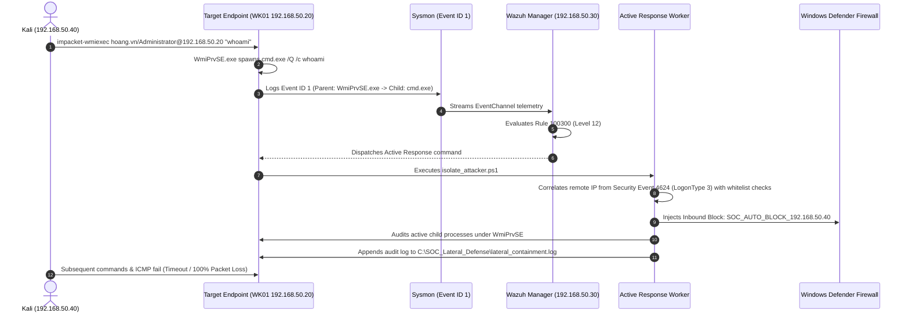
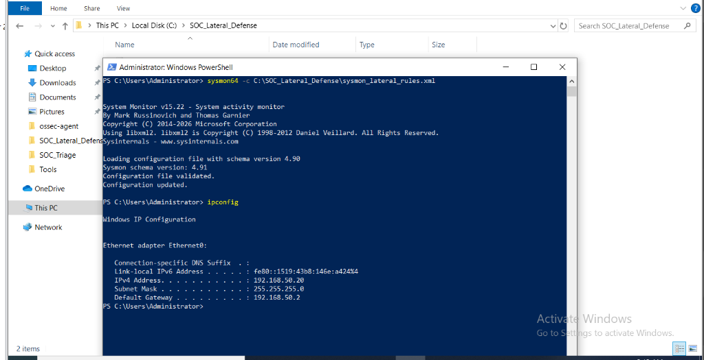
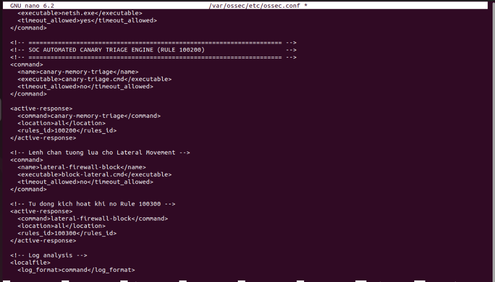
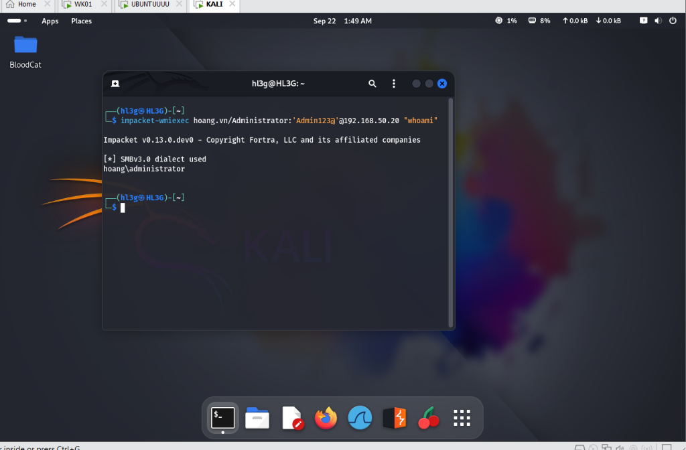
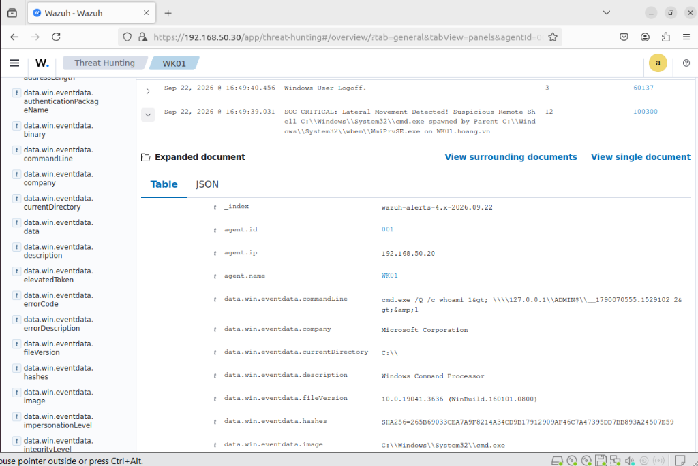
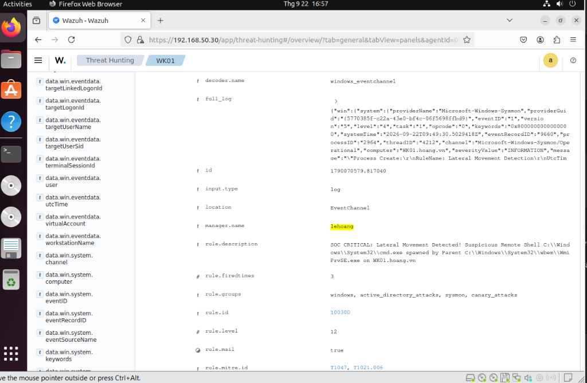
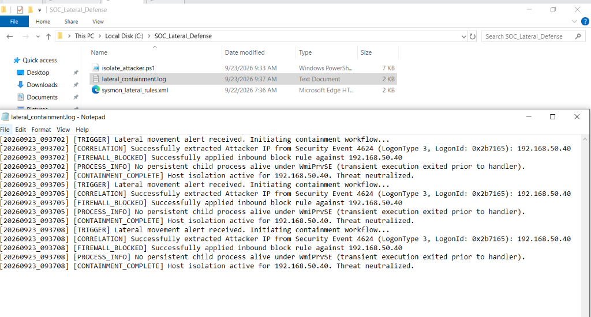
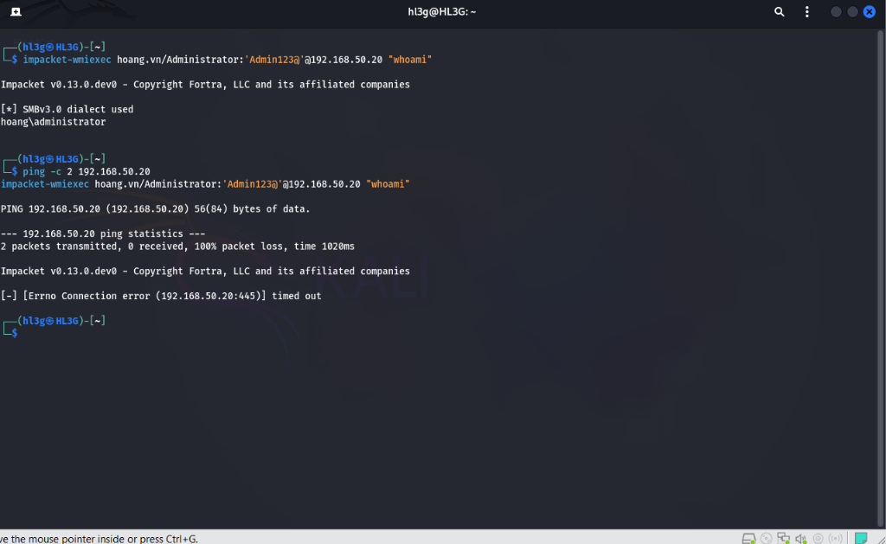

# Active Directory Lateral Movement Detection & Automated Containment Pipeline

A detection engineering and SOAR lab demonstrating how to detect, correlate, and contain **Active Directory lateral movement (WMI / WinRM remote shell execution)** using lightweight endpoint telemetry and dynamic host firewall isolation.

---

## 1. Problem Statement & Threat Model

In Active Directory environments, lateral movement is how an attacker pivots from an initial compromised workstation to high-value assets (Domain Controllers, file servers). Attackers often avoid dropping compiled binaries to evade traditional signature-based Antivirus, instead leveraging built-in **Living-off-the-Land Binaries (LOLBins)**:
- **WMI (`WmiPrvSE.exe`)** via RPC/DCOM (Port 135, dynamic RPC ports) and SMB (Port 445).
- **WinRM (`wsmprovhost.exe`)** via WS-Management (Port 5985/5986).

### Why Traditional AV Fails
Both `WmiPrvSE.exe` and `cmd.exe` are legitimate, digitally signed Microsoft binaries running under system service contexts (`NT AUTHORITY\NETWORK SERVICE`). File hashing and static signatures show 0 detections.

### The Defensive Approach: Process Lineage Correlation
Rather than blocking WMI (which breaks SCCM, monitoring, and administration), we detect the anomalous **Parent-Child process relationship**:
- **Legitimate:** Interactive shells (`cmd.exe`, `powershell.exe`) are spawned by `explorer.exe` (user interactive logon).
- **Malicious:** An interactive shell spawned directly by `WmiPrvSE.exe` or `wsmprovhost.exe` indicates remote execution without a desktop session.

---

## 2. Lab Topology & Environment

| Node | OS | Hostname / Domain | IP Address | Role |
| :--- | :--- | :--- | :--- | :--- |
| **Target Endpoint** | Windows 10 Pro 22H2 | `WK01.hoang.vn` | `192.168.50.20` | Monitored host, Sysmon v15, Wazuh Agent 4.8, Containment Worker |
| **SIEM Server** | Ubuntu 22.04 LTS | `lehoang` | `192.168.50.30` | Wazuh Manager 4.8, Rule Correlation Engine, Active Response Controller |
| **Attacker Host** | Kali Linux 2024.1 | `HL3G` | `192.168.50.40` | Attacker node, Impacket (`wmiexec`), lateral execution |



---

## 3. Engineering Decisions & Telemetry Gaps

Building this containment pipeline highlighted several practical engineering hurdles:

### Challenge 1: The Sysmon Event ID 1 Telemetry Gap (Missing Source IP)
- **The Issue:** Sysmon Event ID 1 (Process Create) captures detailed process execution metadata (`CommandLine`, `ParentImage`, `LogonId`), but it **does not contain the network remote IP address** because process creation occurs within the local kernel namespace after authentication.
- **The Solution:** When WMI lateral movement occurs, Windows logs two events:
  1. `Microsoft-Windows-Sysmon/Operational` -> Event ID 1 (Parent-child execution).
  2. `Security` -> Event ID 4624 with `LogonType: 3` (Network Logon), which explicitly contains `IpAddress`.
- **Implementation in `isolate_attacker.ps1`:** The containment script queries recent Security Event 4624 records generated within the last 60 seconds with `LogonType == 3`. To prevent self-inflicted DoS, a critical infrastructure whitelist protects Domain Controllers (`192.168.50.10`) and default gateways from being blocked if a network logon coincides with the alert.

### Challenge 2: The Short-Lived Process Race Condition (`cmd.exe /c`)
- **The Issue:** Execution via `impacket-wmiexec` runs transient commands with the `/c` switch (e.g., `cmd.exe /Q /c whoami`). These processes execute and terminate in 20-50 milliseconds.
- **The Reality:** By the time Wazuh processes the alert and invokes PowerShell via Active Response (1-2 seconds roundtrip), the transient `cmd.exe` process has already exited.
- **The Engineering Decision:** Attempting to kill the process is secondary; **network-level containment (Firewall block) is the primary defensive anchor**. The script audits child processes under `WmiPrvSE.exe` to terminate any persistent interactive shells or beacon payloads, but relies on immediate inbound host isolation to cut the attacker's pivot path.

### Challenge 3: Evolution of the Containment Worker (v1 Static vs v2 Dynamic Correlation)
- **v1 Prototype:** The initial test script used a static target IP to validate whether Windows Defender Firewall rules could reliably drop live WMI sessions in the lab.
- **v2 Production Engineering:** Upgraded `isolate_attacker.ps1` to dynamically query Security Event 4624 (`LogonType: 3`), correlate with the execution timestamp, enforce a critical infrastructure whitelist (`DC01` `192.168.50.10`, Gateway, loopback) to prevent self-inflicted DoS, and gracefully audit transient child processes under `WmiPrvSE.exe`.

---

## 4. Detection Engineering Configuration

### A. Sysmon Schema (`sysmon/sysmon_lateral_rules.xml`)
Targets the specific parent-child relationships characteristic of WMI and WinRM remote shells:

```xml
<Sysmon schemaversion="4.90">
  <CheckRevocation/>
  <EventFiltering>
    <RuleGroup name="Lateral_Movement_Detection" groupRelation="or">
      <ProcessCreate onmatch="include">
        <!-- 1. WMI Remote Execution (MITRE T1047) -->
        <ParentImage condition="image">WmiPrvSE.exe</ParentImage>
        <!-- 2. WinRM Remoting (MITRE T1021.006) -->
        <ParentImage condition="image">wsmprovhost.exe</ParentImage>
      </ProcessCreate>
    </RuleGroup>
  </EventFiltering>
</Sysmon>
```



### B. Wazuh SIEM Correlation Rule (`wazuh/local_rules.xml`)
Correlates incoming Sysmon Event 1 logs on the Wazuh Manager under **Rule 100300 (Level 12)**:

```xml
<group name="windows,lateral_movement,sysmon,">
  <rule id="100300" level="12">
    <if_group>windows</if_group>
    <field name="win.system.eventID">^1$</field>
    <field name="win.eventdata.parentImage" type="pcre2">(?i)wmiprvse\.exe|wsmprovhost\.exe</field>
    <field name="win.eventdata.image" type="pcre2">(?i)(cmd|powershell|powershell_ise)\.exe</field>
    <description>SOC CRITICAL: Lateral Movement Detected! Suspicious Remote Shell $(win.eventdata.image) spawned by Parent $(win.eventdata.parentImage) on $(win.system.computer)</description>
    <mitre>
      <id>T1047</id>
      <id>T1021.006</id>
    </mitre>
  </rule>
</group>
```

### C. Active Response Configuration (`wazuh/ossec.conf.snippet`)
Binds Rule 100300 to the containment command on the target Windows agent:

```xml
<ossec_config>
  <command>
    <name>lateral-firewall-block</name>
    <executable>block-lateral.cmd</executable>
    <timeout_allowed>no</timeout_allowed>
  </command>

  <active-response>
    <command>lateral-firewall-block</command>
    <location>all</location>
    <rules_id>100300</rules_id>
  </active-response>
</ossec_config>
```



*(Scoping note: In this dedicated single-workstation lab testbed, `<location>all</location>` was configured in `/var/ossec/etc/ossec.conf` as shown above. In enterprise multi-host environments, `<location>local</location>` is standard to isolate containment to the reporting agent).*

---

## 5. Lab Evidence & Verification

### Step 1: Initial WMI Execution from Kali
The adversary executes a remote command via WMI. The initial command succeeds and returns `hoang\administrator`:



### Step 2: SIEM Detection in Wazuh
Wazuh correlates Sysmon Event 1 telemetry and fires Rule 100300 (Level 12) with full process context:
- **Parent Process:** `C:\Windows\System32\wbem\WmiPrvSE.exe`
- **Spawned Image:** `C:\Windows\System32\cmd.exe`
- **Command Line:** `cmd.exe /Q /c whoami 1> \\127.0.0.1\ADMIN$\__1790070555.1529102 2>&1`
- **MITRE ATT&CK:** T1047, T1021.006





### Step 3: Containment Execution & Audit Trail
Active Response triggers `isolate_attacker.ps1`, which dynamically correlates Security Event 4624 (`LogonType 3`, `LogonId: 0x2b7165`) to extract the adversary IP (`192.168.50.40`), deploys the Windows Defender Firewall inbound block rule, audits child processes under `WmiPrvSE.exe`, and logs the full containment trail:



```text
[20260923_093702] [TRIGGER] Lateral movement alert received. Initiating containment workflow...
[20260923_093702] [CORRELATION] Successfully extracted Attacker IP from Security Event 4624 (LogonType 3, LogonId: 0x2b7165): 192.168.50.40
[20260923_093702] [FIREWALL_BLOCKED] Successfully applied inbound block rule against 192.168.50.40
[20260923_093702] [PROCESS_INFO] No persistent child process alive under WmiPrvSE (transient execution exited prior to handler).
[20260923_093702] [CONTAINMENT_COMPLETE] Host isolation active for 192.168.50.40. Threat neutralized.
```

### Step 4: Verification of Containment
Immediately following containment, subsequent network and remote execution attempts from the adversary host (`192.168.50.40`) are dropped by Windows Defender Firewall:
- **ICMP Ping:** `2 packets transmitted, 0 received, 100% packet loss, time 1020ms`.
- **WMI Remote Execution:** `Impacket v0.13.0.dev0` fails with `[-] [Errno Connection error (192.168.50.20:445)] timed out`.



---

## 6. Repository Structure

```text
lateral-movement-soar-pipeline/
├── assets/                    # Verification screenshots and event logs
├── soar/
│   ├── block-lateral.cmd      # Wazuh Active Response bridge
│   └── isolate_attacker.ps1   # Firewall isolation & process audit worker
├── sysmon/
│   └── sysmon_lateral_rules.xml # Sysmon Event 1 process creation filter
├── wazuh/
│   ├── local_rules.xml        # Wazuh detection rule 100300
│   └── ossec.conf.snippet     # Active response configuration snippet
├── .gitignore
└── README.md                  # Project documentation
```

---

## 7. MITRE ATT&CK & D3FEND Mapping

| Framework | ID | Technique / Defend Action | Implementation in Pipeline |
| :--- | :--- | :--- | :--- |
| **ATT&CK** | **T1047** | Windows Management Instrumentation | Monitored via `WmiPrvSE.exe` parent lineage |
| **ATT&CK** | **T1021.006** | Remote Services: Windows Remote Management | Monitored via `wsmprovhost.exe` parent lineage |
| **ATT&CK** | **T1059.003** | Command and Scripting Interpreter: Windows Command Shell | Detected when spawned under administrative LOLBin |
| **D3FEND** | **D3-PSA** | Process Spawn Analysis | Correlating parent-child process creation in Sysmon Event 1 |
| **D3FEND** | **D3-IBC** | Inbound Traffic Filtering | Enforcing host firewall isolation rule on target endpoint |
| **D3FEND** | **D3-PT** | Process Termination | Auditing and terminating active attacker shells under WMI |

---

## 8. Practical SOC Takeaways

1. **Process Lineage Over File Hashes:** LOLBin attacks execute legitimate, digitally signed OS binaries (`WmiPrvSE.exe`, `cmd.exe`). Traditional signature AV fails completely. Detection must anchor on anomalous parent-child lineage.
2. **Bridging the Telemetry Gap:** Sysmon Event 1 provides deep process execution context but lacks remote network IP. Correlating with Security Event 4624 (LogonType 3) bridges this gap dynamically without hardcoding attacker IP addresses.
3. **Network Containment Outweighs Process Termination:** Transient LOLBin executions (`cmd.exe /c`) finish in milliseconds before SOAR scripts can run. While process auditing remains necessary for persistent shells, dynamic firewall isolation provides the definitive containment that stops lateral pivoting.

---

## 9. Lab Scope, Production Considerations & Known Limitations

> [!NOTE]
> **Proof-of-Concept (POC) Disclaimer:** This pipeline demonstrates dynamic host firewall isolation and process correlation in an isolated VMware virtual environment.

### Operational Caveats & Enterprise Refinements:
1. **Event 4624 Correlation Precision:** In this POC, the containment worker correlates the most recent Network Logon (`LogonType 3`) within a 60-second window while filtering against a critical infrastructure whitelist (Domain Controllers, default gateways, loopback). In high-density production environments with concurrent administrative logons, precise correlation should bind the exact `TargetLogonId` passed directly from SIEM event payload metadata rather than scanning the recent event log.
2. **Fail-Safe Containment Logic:** If dynamic IP resolution fails, the script safely aborts (`exit 1`) with an audit log entry rather than applying unverified block rules.
3. **Active Response Scoping:** In enterprise multi-agent deployments, Active Response commands should be scoped to `<location>local</location>` (or specific agent groups) rather than broadcasting to all endpoints.

